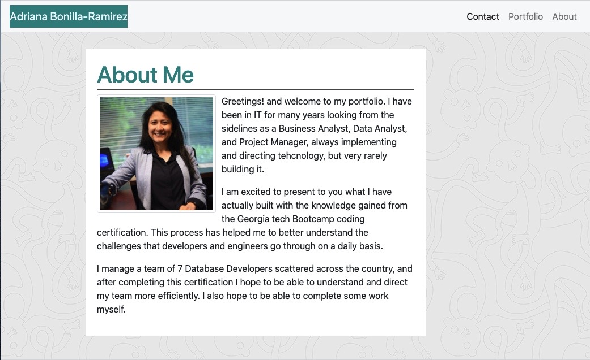
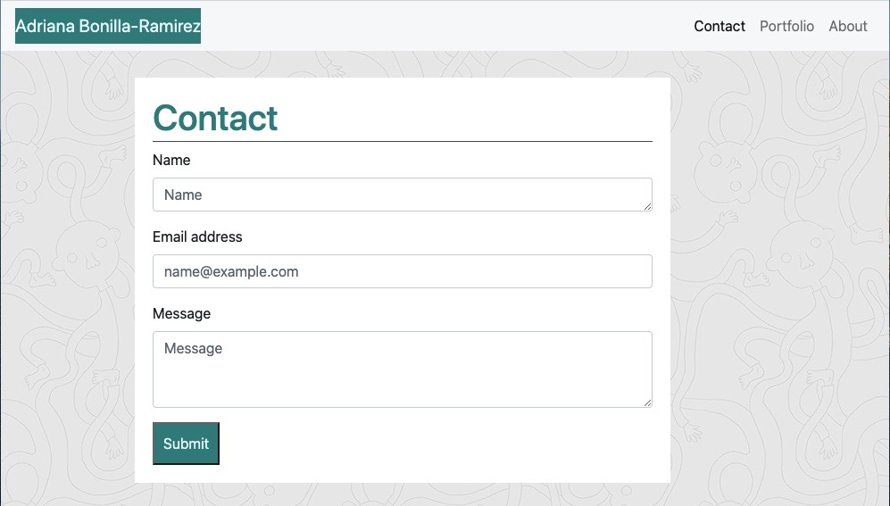
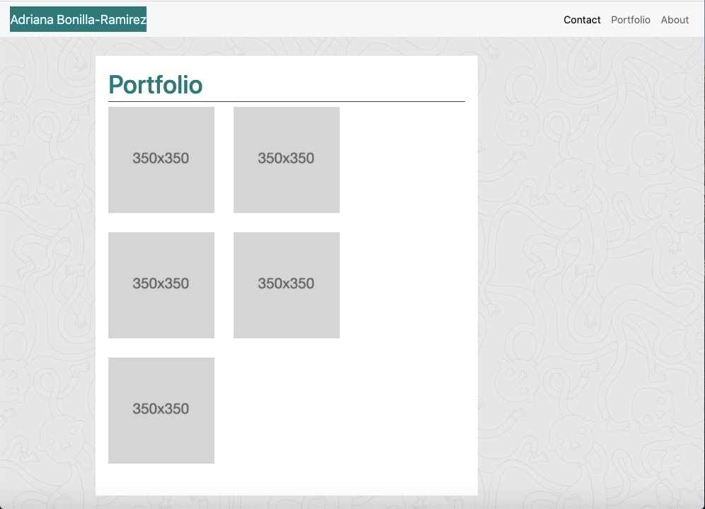

# responsive-portfolio

The obejctive of this project is to create a clean portfolio page with 3 pages - About me, Contact, and Portfolio. The design needs to be responsive so users and visitors can access it through various mobile devices and it renders well.

The project involved the use of Bootstrap elements, edia queries, and CSS styling file.

Development phase:
 - Created the three main files - `index.html`, `portfolio.html` and `contact.html`.
 - Sketched the pages using pen and paper in order to calculate the number of rows and columns that would be needed for the layouts
 - Added the required elements from Bootstrap - Nav bar, container for photo and text, and forms.
 - Brough over the scripts from Bootstrap, and created the CSS file.
 - Added a simple media query that changes the background when the screen becomes too small

 Testing phase:
 - Ensure that the pages look as close as possible to the examples provided and made adjustments as required
 - Revise column widths
 - Ensure that the page loaded correctly to Github and tested the various elements.
 - Checked code using an Html validation service

 Deployment phase:
 - Final push to Git Hub
 - Final test live

 Please visit my site here - https://adrianalbr.github.io/responsive-portfolio/contact.html

See screenshots below

copyright (c) 2020 Adriana Bonilla-Ramirez

